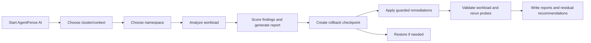

# AgentFence AI

`AgentFence AI` audits Kubernetes sandbox workloads, recommends fixes, applies supported remediations with rollback protection, validates the result, and writes reviewable evidence artifacts for operator follow-up.

It is an extension of the [Agentic AI Sandbox Security Evaluation](https://github.com/farshadrahaei/agentic-ai-sandbox-security-evaluation) project, with major additions for operational use:

- remediation workflows
- enforced backup and restore support
- review-only communication exposure reporting
- TBE/ELE risk scoring
- an interactive AI CLI for guided analysis, remediation, restore, and report Q&A

For a sandbox-by-sandbox explanation of `CUA`, `gVisor`, `Kata`, and how the files in `generated_outputs/` are produced, see [SANDBOX_ARCHITECTURE_AND_RESULTS.md](SANDBOX_ARCHITECTURE_AND_RESULTS.md).

## Why this app matters

Modern agentic AI workloads often run in Kubernetes sandboxes that are more dynamic than traditional applications. They may need browsers, writable workspace volumes, temporary artifacts, network egress to model gateways, or interactive runtime components. That creates a gap between:

- what the workload needs to function
- what the workload should be allowed to do from a security perspective

`AgentFence AI` exists to close that gap.

Instead of treating remediation as a one-time manifest review, it helps operators:

- inspect the live runtime posture of a workload
- identify risky configuration, image, runtime, and communication patterns
- apply safe or bounded remediations with rollback protection
- verify whether the workload still behaves correctly after remediation
- preserve manual recommendations for findings that require operator intent

This is especially useful for sandboxed AI environments like CUA, gVisor, and Kata, where the real question is often not only "what is insecure?" but also "can we harden this safely without breaking the workload?"

## Repository contents

The public repository is intended to include:

- `agentfence.py`: the single runtime application file.
- `README.md`: operator setup, run instructions, scoring notes, and artifact guidance.
- `SANDBOX_ARCHITECTURE_AND_RESULTS.md`: sandbox architecture, artifact interpretation, and current result summary.
- `generated_outputs/`: selected sanitized analysis and evaluation artifacts from reported sandbox runs.

The repository should not include raw rollback bundles from a live cluster. Rollback bundles are intentionally generated locally by `AgentFence AI` during backup, remediation, and analyze-remediation workflows because each Kubernetes setup is unique. A valid restore bundle depends on the namespace, workload names, runtime classes, node placement, image pull secrets, network policies, RBAC state, storage resources, and cluster-specific dependencies present when the bundle is created.

Published report artifacts are evidence of what `AgentFence AI` observed and how it scored or remediated a run. Raw rollback bundles are operational recovery material for the specific cluster where they were generated.

## Single runtime file

The runtime application is:

```bash
agentfence.py
```

`AgentFence AI` does not require shell runners, helper Python modules, or separate executable scripts to operate. Run every app action through:

```bash
python3 agentfence.py ...
```

Files written under `generated_outputs/` are artifacts produced by the app. They are not separate application entry points.

## Background

`AgentFence AI` combines two ideas:

1. deterministic AgentFence audit and remediation logic
2. an optional conversational AI operator experience

The deterministic layer remains the source of truth for:

- probe execution
- risk scoring
- remediation eligibility
- backup creation
- rollback handling
- Kubernetes mutation
- post-fix validation

The AI layer helps drive the workflow, explain findings, and answer questions about the latest report. It does not invent privileged mutations outside the deterministic remediation engine.

## App modes

| App mode | Experience | Best for |
| --- | --- | --- |
| `default` | deterministic CLI | scripting, repeatable runs, non-AI operation |
| `ai` | interactive guided CLI | cluster/namespace selection, guided actions, report Q&A |

Both modes use the same probe catalog, scoring formula, backup gate, remediation logic, validation path, and artifact schema.

## Workflow



## Prerequisites

Required:

- Python 3.9 or newer.
- `kubectl` installed and available on `PATH`.
- A Kubernetes cluster reachable from the machine running `AgentFence AI`.
- A usable Kubernetes context through the default `kubectl` runtime configuration, `--kubeconfig`, or `KUBECONFIG`.
- Network access to the cluster, either directly or through VPN.
- RBAC permissions to read pods, deployments, services, namespaces, runtime classes, network policies, and related namespace resources.

For remediation, backup, and restore:

- RBAC permissions to patch or apply affected workload resources.
- Permission to read and restore namespaced objects captured in rollback bundles.
- Permission to read Secret objects if comprehensive secret-inclusive checkpoints are used. Use `--omit-secrets-backup` when Secret capture is not desired.

For optional node/runtime hardening:

- Administrative access to the target node/runtime path is required.
- `AgentFence AI` preflights applicability first and only prompts or applies node/runtime hardening when the control is relevant and not already satisfied.
- Node/runtime hardening can affect workloads sharing the same node or runtime handler, so use it only in operator-approved environments.

For AI explanations and Q&A:

- AI mode can still guide deterministic actions without an AI backend.
- AI-generated answers require an OpenAI-compatible credential.
- Credentials are not embedded in reports, source files, or generated artifacts.

## Configure AI backend credential

AI mode can run Kubernetes discovery, action selection, analyze, remediation, backup, and restore without an AI API key. A key is only needed when the operator asks `AgentFence AI` to explain the latest report or answer follow-up questions through the AI backend.

`AgentFence AI` looks for a credential in this order:

1. `OPENAI_API_KEY`
2. `AGENTFENCE_OPENAI_API_KEY`
3. macOS Keychain
4. Python keyring

### Environment variable

```bash
export OPENAI_API_KEY="YOUR_API_KEY"
python3 agentfence.py --app-mode ai
```

Or:

```bash
export AGENTFENCE_OPENAI_API_KEY="YOUR_API_KEY"
python3 agentfence.py --app-mode ai
```

### macOS Keychain

```bash
security add-generic-password \
  -s "AgentFence OpenAI API Key" \
  -a "default" \
  -w "YOUR_API_KEY" \
  -U
```

Custom Keychain service/account names are supported:

```bash
export AGENTFENCE_OPENAI_KEYCHAIN_SERVICE="AgentFence OpenAI API Key"
export AGENTFENCE_OPENAI_KEYCHAIN_ACCOUNT="default"
python3 agentfence.py --app-mode ai
```

### Python keyring

```bash
python3 -m pip install keyring
python3 - <<'PY'
import keyring
keyring.set_password("AgentFence OpenAI API Key", "default", "YOUR_API_KEY")
PY
python3 agentfence.py --app-mode ai
```

Optional model and endpoint settings:

```bash
export AGENTFENCE_AI_MODEL="gpt-4.1-mini"
export AGENTFENCE_OPENAI_BASE_URL="https://api.openai.com/v1/responses"
```

`AgentFence AI` does not print the credential source during normal report Q&A. It also does not write the key into JSON reports, Markdown reports, rollback bundles, or evaluation-factor artifacts.

## Quick start

Move into the package folder:

```bash
cd "AgentFence AI"
```

Check cluster access:

```bash
kubectl config get-contexts
kubectl get namespaces
```

Run self-test:

```bash
python3 agentfence.py --action self-test
```

Start AI mode:

```bash
python3 agentfence.py --app-mode ai
```

Run default-mode analyze:

```bash
python3 agentfence.py --app-mode default --action analyze --namespace sandbox-kata-fresh
```

## Default mode

Default mode is the deterministic, flag-driven interface.

Use it when you want:

- a repeatable CLI workflow
- scripting or automation
- no AI dependency
- explicit control over context, namespace, action, and optional target pod

Launch pattern:

```bash
python3 agentfence.py --app-mode default --action <action> --namespace <namespace>
```

### Default mode actions

| Action | Behavior |
| --- | --- |
| `analyze` | run probes and write analysis reports |
| `remediation` | create rollback checkpoint, analyze, apply safe fixes, verify, and report |
| `analyze-remediation` | run analysis and remediation as one workflow |
| `backup-namespace` | create a rollback bundle for a namespace |
| `restore-namespace` | restore from a rollback bundle |
| `self-test` | validate catalog, scoring, alias handling, and internal consistency |

### Useful flags

| Flag | Purpose |
| --- | --- |
| `--app-mode default` | runs deterministic mode |
| `--cluster <context>` | uses a Kubernetes context for this run |
| `--kubeconfig <path>` | uses a specific kubeconfig |
| `--namespace <name>` or `-n <name>` | target namespace |
| `--target-pod <name>` | override target pod selection |
| `--action <action>` | workflow action |
| `--timeout <seconds>` | per-probe `kubectl exec` timeout |
| `--dry-run` | validate catalog and target selection without running probes |
| `--out <path>` | write main JSON report to a specific path |
| `--md-out <path>` | write main Markdown report to a specific path |
| `--headline-alpha <value>` | set headline score blend weight, default `0.6` |
| `--backup-parent-dir <dir>` | choose where rollback bundles are written |
| `--create-backup` | opt into a backup for analyze-only runs |
| `--omit-secrets-backup` | omit Secret objects from rollback checkpoints |
| `--velero-backup` | also request a Velero namespace backup when Velero is installed |
| `--allow-node-runtime-remediation` | allow operator-approved node/runtime hardening when applicable |

`--no-backup` is rejected for `remediation` and `analyze-remediation`. Those actions require a rollback checkpoint before mutation.

### Default mode examples

Analyze:

```bash
python3 agentfence.py --app-mode default --action analyze --namespace sandbox-cua-fresh
```

Run remediation:

```bash
python3 agentfence.py --app-mode default --action remediation --namespace sandbox-cua-fresh
```

Run analyze and remediation together:

```bash
python3 agentfence.py --app-mode default --action analyze-remediation --namespace sandbox-cua-fresh
```

Create a namespace rollback bundle:

```bash
python3 agentfence.py --app-mode default --action backup-namespace --namespace sandbox-cua-fresh
```

Restore from a rollback bundle:

```bash
python3 agentfence.py --app-mode default --action restore-namespace --bundle-dir generated_outputs/rollback_bundle_<namespace>_<target>_<timestamp>
```

## AI mode

AI mode is interactive and guided.

Launch:

```bash
python3 agentfence.py --app-mode ai
```

Expected flow:

1. `AgentFence AI` discovers available Kubernetes contexts through `kubectl`.
2. The operator selects a cluster/context.
3. `AgentFence AI` lists namespaces.
4. The operator selects a namespace.
5. `AgentFence AI` offers Analyze, Remediation, Analyze&Remediation, Backup, and Restore.
6. After a run, `AgentFence AI` loads the latest report context so the operator can ask follow-up questions.

Interactive commands include:

```text
list clusters
use cluster <name-or-number>
list namespaces
use namespace <name-or-number>
analyze
remediate
analyze-remediation
backup
restore
status
help
exit
```

Where supported, `cancel` returns to the main prompt and `exit` quits the app.

## What appears on screen

AI mode keeps command output concise. Restore prints a summary of success or failure rather than dumping full object patches. Analyze and remediation runs write detailed reports to `generated_outputs/`, then load the latest report context for follow-up questions.

## Generated artifacts

Generated files are written to:

```text
generated_outputs/
```

Current artifact names use the `agentfence_*` prefix. Older `guided_*` artifacts in this repository are legacy examples from earlier versions.

Typical current artifacts:

```text
agentfence_<action>_<namespace>_<timestamp>.json
agentfence_<action>_<namespace>_<timestamp>.md
agentfence_f1_f5_<action>_<namespace>_<timestamp>.json
agentfence_f1_f5_<action>_<namespace>_<timestamp>.md
rollback_bundle_<namespace>_<target>_<timestamp>/
```

Common artifact types:

| Artifact | Purpose |
| --- | --- |
| main JSON report | machine-readable probe evidence, scoring, remediation plan, before/after deltas |
| main Markdown report | human-readable finding explanations, fixed probes, residual findings, manual recommendations |
| evaluation-factor JSON/Markdown | workload context, analyze summary, remediation effectiveness, artifact consistency, recoverability |
| rollback bundle | local restore checkpoint generated before mutation |

## Scoring

Probe status meanings:

- `pass`: unsafe condition observed.
- `fail`: unsafe condition not observed.
- `skip`: probe could not be assessed.

Scored unsafe probes receive fixed severity weights:

- critical: `5.0`
- high: `3.0`
- medium: `1.0`
- low: `0.5`

`AgentFence AI` reports raw weighted score, TBE raw and normalized score, ELE raw and normalized score, and headline score. TBE and ELE are disjoint so raw score mass is not double-counted.

The headline score is:

```text
headline = alpha * TBE_normalized + (1 - alpha) * ELE_normalized
```

The default `alpha` is `0.6`. Lower scores are better.

## Review-only reachability

`AgentFence AI` measures service reachability from an adjacent measurement pod, but unauthenticated reachability is treated as review-only communication exposure. It remains visible in reports and manual recommendations, but it does not contribute to issue count, raw score, TBE score, ELE score, headline score, or automatic remediation.

This is intentional: an open service path may be required by the workload. `AgentFence AI` reports the observation and asks the operator to define expected callers, ports, authentication requirements, and least-privilege NetworkPolicy intent.

## Remediation behavior

Every probe has remediation coverage as one of:

- `auto_fix`: guarded fix that `AgentFence AI` can apply and verify.
- `hybrid`: partially automatable or environment-dependent fix requiring extra checks.
- `manual_recommendation`: operator action required.

`AgentFence AI` applies only guarded fixes, validates the workload afterward, and records the result. Findings that require image rebuilds, workload redesign, runtime decisions, node-level changes, or communication-intent review remain visible as manual residual work.

Node/runtime hardening is preflight-gated. Even if node/runtime remediation is allowed, `AgentFence AI` first checks whether the control is applicable and already satisfied. If it is not applicable, it is skipped.

## Backup and restore

`remediation` and `analyze-remediation` enforce a rollback checkpoint before any mutation. If the checkpoint fails, `AgentFence AI` exits without applying changes.

Create a backup:

```bash
python3 agentfence.py --action backup-namespace --namespace YOUR_NAMESPACE
```

Restore from a backup:

```bash
python3 agentfence.py --action restore-namespace --bundle-dir generated_outputs/rollback_bundle_<namespace>_<target>_<timestamp>
```

Rollback bundles may contain:

- `backup_manifest.json`
- namespace snapshots
- affected resource snapshots
- cluster dependency metadata
- checksums
- validation metadata

By default, comprehensive checkpoints include Secret objects. Use `--omit-secrets-backup` when Secret capture is not desired. Rollback bundles restore Kubernetes resources captured by `AgentFence AI`; they are not universal application-state backups for external systems or persistent data unless those resources are also captured by the operator's storage backup process.

Raw rollback bundles are intentionally not included in the public repository because they can contain environment-specific and sensitive material, including image pull secrets, registry credentials, service-account metadata, internal node names, pod IPs, network CIDRs, absolute local paths, Kubernetes events, and cluster dependency snapshots. Operators should generate rollback bundles in their own environment immediately before remediation so the bundle matches the actual cluster state that may need to be restored.

## Package contents

- `agentfence.py`
- `README.md`
- `SANDBOX_ARCHITECTURE_AND_RESULTS.md`
- selected sanitized files under `generated_outputs/`

## Troubleshooting

### `kubectl` not found

Install `kubectl` and confirm:

```bash
kubectl version --client
```

### No cluster or namespace appears

Check:

```bash
kubectl config get-contexts
kubectl get namespaces
```

Also confirm VPN or network access if the cluster is private.

### Permission denied

Confirm the current Kubernetes identity can read target resources. Remediation and restore require write permissions for affected resources.

### Backup failed

Remediation and analyze-remediation stop before mutation when rollback checkpoint creation fails. Check RBAC permissions and whether Secret capture is allowed.

### AI mode cannot answer report questions

Deterministic actions still run. Configure an AI credential through environment variables, macOS Keychain, or Python keyring.

### Workload validation failed after remediation

Review the generated Markdown report and rollback metadata. The report records fixed probes, rolled-back changes, verification warnings, and manual recommendations.

## Portability

To use the tool in another Kubernetes setup, copy the repository, ensure `python3` and `kubectl` are installed, and provide kubeconfig access to the target cluster. Do not reuse raw rollback bundles across environments; generate a new bundle in the target environment immediately before remediation.

## License

Copyright (c) 2026 Farshad Rahaei

This project is licensed under the Apache License 2.0. See the `LICENSE` file for details.
