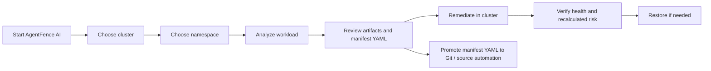

# AgentFence AI

`AgentFence AI` audits Kubernetes sandbox workloads, recommends fixes, applies supported remediations with rollback protection, and generates source-of-truth manifest updates for permanent fixes.

It is an extension of the [Agentic AI Sandbox Security Evaluation](https://github.com/farshadrahaei/agentic-ai-sandbox-security-evaluation) project, with major additions for operational use:

- remediation workflows
- backup and restore support
- an interactive AI CLI for guided analysis and remediation

## Why this app matters

Modern agentic AI workloads often run in Kubernetes sandboxes that are intentionally more dynamic than traditional applications. They may need browsers, writable workspace volumes, temporary artifacts, or interactive runtime components. That makes them useful for research and experimentation, but it also creates a bigger gap between:

- what the workload needs to function
- what the workload should be allowed to do from a security perspective

`AgentFence AI` exists to close that gap.

Instead of treating remediation as a one-time manifest review, it helps operators:

- inspect the live runtime posture of a workload
- identify risky configuration and image patterns
- apply safe or bounded remediations with rollback protection
- verify whether the workload still behaves correctly after remediation
- export a recommended manifest YAML so the final fix can be made permanent in source automation such as Git

This is especially useful for sandboxed AI environments like CUA, gVisor, and Kata, where the real question is often not only "what is insecure?" but also "can we harden this safely without breaking the workload?"

## Background

`AgentFence AI` combines two ideas:

1. deterministic AgentFence audit and remediation logic
2. an optional conversational AI operator experience

The deterministic layer remains the source of truth for:

- audit logic
- risk scoring
- fix grouping
- backup creation
- rollback handling
- in-cluster remediation execution

The AI layer adds a friendlier way to drive the workflow, explain findings, and surface the next step without changing the core enforcement logic.

It has two app modes:

| App mode | Experience | Best for |
| --- | --- | --- |
| `default` | deterministic CLI | scripting, repeatable runs, non-AI operation |
| `ai` | interactive chat assistant | guided investigation, remediation, and rollback |

## What it does

- discovers the target workload inside a namespace
- analyzes security posture and risk
- recommends permanent manifest changes
- creates rollback bundles before live changes
- applies supported remediations
- revalidates workload health after remediation

## Workflow



## Requirements

- `python3`
- `kubectl`
- kubeconfig access to the target cluster

No third-party Python packages are required for the core script.

Optional for AI mode:

- OpenAI API key
- `AGENTFENCE_OPENAI_MODEL` if you want to override the default model
- Python `keyring` on Linux if you want secure local secret storage

## Create an OpenAI API key

1. Sign in to the OpenAI API platform.
2. Open [OpenAI API keys](https://platform.openai.com/api-keys).
3. Select `Create new secret key`.
4. Name the key and save it immediately.

Important:

- the key is only shown once when created
- each user should use their own key
- never commit the key to source control

## Secure API key setup

### macOS (recommended)

Store the key in Keychain:

```bash
security add-generic-password -U -s "AgentFence OpenAI API Key" -a "default" -w "your_api_key_here"
```

### Linux (optional)

Install `keyring` and store the key:

```bash
python3 -m pip install keyring
python3 -c "import keyring; keyring.set_password('AgentFence OpenAI API Key', 'default', 'your_api_key_here')"
```

AgentFence AI checks for the key in this order:

1. `OPENAI_API_KEY`
2. macOS Keychain entry `AgentFence OpenAI API Key` / `default`
3. Python `keyring` entry `AgentFence OpenAI API Key` / `default`

## Quick start

Move into the package folder:

```bash
cd "AgentFence AI"
```

Check your current cluster context:

```bash
kubectl config current-context
```

Start default mode:

```bash
python3 agentfence.py --app-mode default --cluster kubernetes --namespace sandbox-cua --action analyze
```

Start AI mode:

```bash
python3 agentfence.py --app-mode ai
```

## Default mode

Default mode is the deterministic, flag-driven interface.

Use it when you want:

- a repeatable CLI workflow
- scripting or automation
- no AI dependency
- explicit control over cluster, namespace, action, and optional workload selection

Launch pattern:

```bash
python3 agentfence.py --app-mode default --cluster <cluster> --namespace <namespace> --action <action>
```

### Default mode flags

| Flag | Required | Purpose |
| --- | --- | --- |
| `--app-mode default` | yes | runs classic deterministic mode |
| `--cluster` | yes | target Kubernetes cluster/context name |
| `--namespace` | yes | target namespace |
| `--action` | yes | workflow action to execute |
| `--workload-name` | optional | explicit workload name if you want to pin a workload |
| `--timeout` | optional | probe / collection timeout |
| `--restore-bundle-dir` | optional | explicit rollback bundle directory for restore flows |

### Default mode actions

| Action | Behavior |
| --- | --- |
| `analyze` | analyze only |
| `backup-restore` | create or restore rollback bundle |
| `remediation` | analyze and remediate |
| `analyze-remediation` | analyze and remediate in one run |

### Default mode examples

Analyze only:

```bash
python3 agentfence.py --app-mode default --cluster kubernetes --namespace sandbox-cua --action analyze
```

Analyze a specific workload:

```bash
python3 agentfence.py --app-mode default --cluster kubernetes --namespace sandbox-cua --action analyze --workload-name target-cua
```

Run backup / restore workflow:

```bash
python3 agentfence.py --app-mode default --cluster kubernetes --namespace sandbox-cua --action backup-restore
```

Run remediation:

```bash
python3 agentfence.py --app-mode default --cluster kubernetes --namespace sandbox-cua --action remediation
```

Run analyze and remediation together:

```bash
python3 agentfence.py --app-mode default --cluster kubernetes --namespace sandbox-cua --action analyze-remediation
```

Restore from a specific bundle:

```bash
python3 agentfence.py --app-mode default --cluster kubernetes --namespace sandbox-cua --action backup-restore --restore-bundle-dir generated_outputs/rollback_bundle_sandbox-cua_target-cua_<timestamp>
```

### What default mode produces

Depending on action, default mode can produce:

- analyze JSON
- analyze Markdown
- remediation JSON
- remediation Markdown
- rollback bundle
- manifest YAML recommendation
- post-fix revalidation data

## AI mode

AI mode is chat-first and interactive.

Launch:

```bash
python3 agentfence.py --app-mode ai
```

Typical session:

```text
choose kubernetes
choose sandbox-cua
analyze
remediate
restore
exit
```

Common chat inputs:

- `list clusters`
- `choose kubernetes`
- `choose sandbox-cua`
- `analyze`
- `backup`
- `remediate`
- `analyze and remediate`
- `restore`
- `show manifest`
- `status`
- `exit`

AI mode automatically:

- walks the user through cluster and namespace selection
- auto-selects the workload when only one candidate exists
- generates analyze artifacts and manifest YAML
- creates a backup before remediation
- shows recalculated risk after remediation

## What appears on screen

After `analyze`, AI mode shows only:

1. `Summary`
2. `Downloadable artifacts`
3. `Recommended next step`

After `remediate` or `analyze and remediate`, AI mode shows only:

1. `Summary`
2. `Downloadable artifacts`
3. `Recommended next step`

The remediation summary includes:

- remediation status
- number of applied steps
- recalculated risk score after remediation
- post-fix health status

## Downloadable artifacts

Generated files are written to:

```text
generated_outputs/
```

Common artifacts:

| Artifact | Purpose |
| --- | --- |
| analyze JSON | raw audit output |
| analyze Markdown | human-readable audit report |
| remediation JSON | fix execution details |
| remediation Markdown | human-readable remediation report |
| manifest YAML | permanent source-of-truth fix recommendation |
| rollback bundle | restore point before live changes |

## Example outputs

After `analyze`, artifacts typically include:

- analyze JSON
- analyze Markdown
- manifest recommendation YAML

After `remediate` or `analyze and remediate`, artifacts typically include:

- analyze JSON
- analyze Markdown
- remediation JSON
- remediation Markdown
- manifest recommendation YAML
- rollback bundle manifest
- rollback bundle directory

## Example workflows

### Example

```bash
python3 agentfence.py --app-mode ai
```

Then:

```text
choose kubernetes
choose sandbox-cua
analyze
remediate
restore
```

## Troubleshooting

### AI mode cannot answer

Check:

- OpenAI API key is configured
- API billing is active
- cluster/network access is available

### `restore` is unavailable

Create a backup first, or remediate once so a rollback bundle exists.

### Analyze results look incomplete

Check:

- target pod is reachable
- `kubectl` context and namespace are correct
- the workload has enough signals for internal and remote validation

## Package contents

- `agentfence.py`
- `README.md`

## Portability

To move the tool to another system, copy the `AgentFence AI` folder and ensure:

- `python3` is installed
- `kubectl` is installed
- kubeconfig access is available

You do not need to copy:

- old `generated_outputs/`
- local experiment artifacts outside the package folder

## License

Copyright (c) 2026 Farshad Rahaei

This project is licensed under the Apache License 2.0. See the `LICENSE` file for details.
